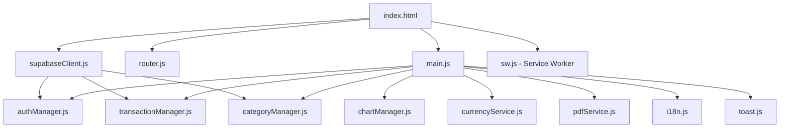
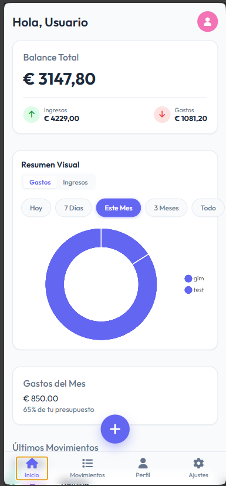
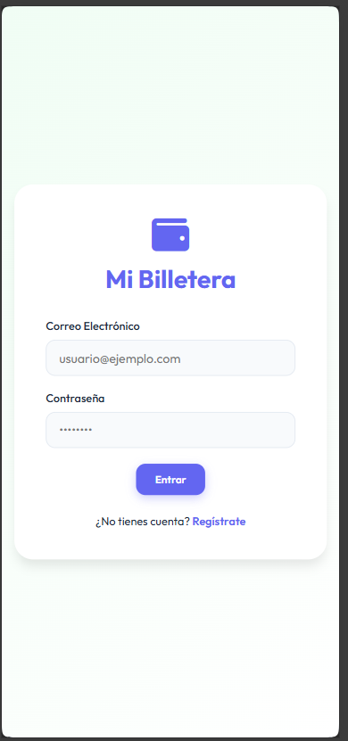
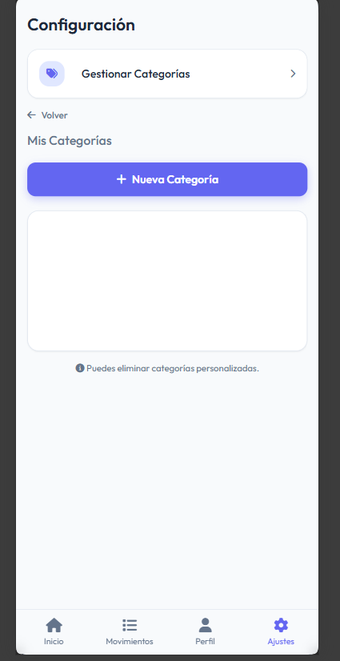
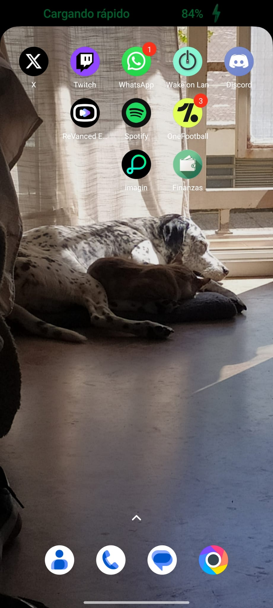

# Documentación Técnica: App de Finanzas Personales (PWA)

---

## 1. Introducción y Objetivos

Desarrollo de una **Aplicación Web Progresiva (PWA)** para la gestión de gastos personales. El objetivo principal fue crear una herramienta ligera, accesible desde cualquier dispositivo y con capacidad de instalación nativa, sin depender de frameworks pesados.

### Características Clave

- **Arquitectura SPA** (Single Page Application) con enrutamiento por hash.
- **Diseño Mobile-First** y adaptativo con soporte para tema oscuro.
- **Persistencia de datos en la nube** mediante Supabase (PostgreSQL + Auth).
- **Funcionamiento Offline** gracias al Service Worker (Cache First).
- **Instalable como app nativa** en Android/iOS vía PWABuilder / manifest.json.
- **Internacionalización** (i18n) con soporte para Español e Inglés.
- **Exportación de datos** a CSV y PDF personalizado.

---

## 2. Stack Tecnológico

| Capa | Tecnología |
|---|---|
| **Frontend** | HTML5, CSS3 (Variables nativas, Dark Mode), JavaScript Vanilla ES6+ |
| **Backend / BaaS** | Supabase (PostgreSQL + Auth + Storage) |
| **Visualización** | Chart.js (Gráficos de donut/barra) |
| **Iconografía** | Font Awesome 6.4 |
| **PDF** | jsPDF + jsPDF-AutoTable |
| **Tipografía** | Google Fonts (Outfit) |
| **Hosting** | GitHub Pages |
| **Empaquetado** | PWABuilder (Generación de APK vía TWA) |

---

## 3. Arquitectura de la Solución

### 3.1. Estructura de Archivos

El proyecto sigue una arquitectura **modular con clases globales**, donde cada módulo se expone vía `window.*` para facilitar la comunicación entre componentes sin bundler:

```
finanzas/
├── index.html              # Punto de entrada único (SPA)
├── style.css               # Estilos globales, temas, responsive
├── manifest.json           # Configuración PWA (nombre, iconos, orientación)
├── sw.js                   # Service Worker (Cache First / Network Only)
│
├── main.js                 # Lógica principal e inicialización
├── router.js               # Hash Router (navegación SPA)
├── authManager.js          # Gestión de autenticación (Supabase Auth)
├── transactionManager.js   # CRUD de transacciones + Upload de recibos
├── categoryManager.js      # CRUD de categorías personalizadas
├── chartManager.js         # Configuración y renderizado de Chart.js
├── currencyService.js      # Conversión de divisas (API externa)
├── pdfService.js           # Generación de informes PDF
├── toast.js                # Sistema de notificaciones Toast
├── i18n.js                 # Internacionalización (ES/EN)
├── supabaseClient.js       # Inicialización del cliente Supabase
│
├── assets/
│   ├── icon-192.png        # Icono PWA (192x192)
│   └── icon-512.png        # Icono PWA (512x512)
│
└── documentacion/
    ├── documentacion.md    # Este archivo
    └── capturas/           # Screenshots de la app
```

### 3.2. Módulos y Responsabilidades

| Módulo | Clase/Función | Responsabilidad |
|---|---|---|
| `supabaseClient.js` | — | Inicializa el cliente Supabase y lo expone como `window.supabaseClient` |
| `authManager.js` | `AuthManager` | `signUp()`, `signIn()`, `signOut()`, `getUser()`, `onAuthStateChange()` |
| `transactionManager.js` | `TransactionManager` | `init()`, `add()`, `remove()`, `update()`, `uploadReceipt()`, `exportToCSV()`, `getSummary()` |
| `categoryManager.js` | `CategoryManager` | `init()`, `createDefaults()`, `add()`, `remove()`, `getAll()` |
| `chartManager.js` | `ChartManager` | Renderiza gráficos de donut por categoría con filtros temporales |
| `currencyService.js` | `CurrencyService` | `getRate(from, to)` — Conversión de divisas vía API pública |
| `pdfService.js` | `PDFService` | `generatePDF()` — Informe financiero filtrado por categorías |
| `i18n.js` | `TranslationManager` | `t(key)`, `setLanguage()`, `updateView()` — Diccionario ES/EN |
| `router.js` | `Router` | Navegación hash-based con guardias de visibilidad (nav/FAB) |
| `toast.js` | `showToast()` | Notificaciones tipo toast con auto-dismiss |
| `sw.js` | Service Worker | Cache First para App Shell, Network Only para API Supabase |
| `main.js` | — | Orquestador: inicializa managers, configura eventos, renderiza UI |

### 3.3. Diseño de Base de Datos (Supabase)

Se implementaron dos tablas principales con **Row Level Security (RLS)** para garantizar que cada usuario solo acceda a sus propios datos:

**Tabla `transactions`:**

| Columna | Tipo | Descripción |
|---|---|---|
| `id` | UUID (PK) | Identificador único |
| `user_id` | UUID (FK) | Referencia al usuario autenticado |
| `title` | TEXT | Concepto del movimiento |
| `amount` | NUMERIC | Cantidad en EUR |
| `type` | TEXT | `income` o `expense` |
| `category` | TEXT | Nombre de la categoría |
| `date` | TIMESTAMP | Fecha del movimiento |
| `receipt_url` | TEXT | URL pública del recibo adjunto (opcional) |

**Tabla `categories`:**

| Columna | Tipo | Descripción |
|---|---|---|
| `id` | UUID (PK) | Identificador único |
| `user_id` | UUID (FK) | Referencia al usuario |
| `name` | TEXT | Nombre de la categoría |
| `icon` | TEXT | Clase FontAwesome (ej: `fa-tag`) |
| `color` | TEXT | Color hexadecimal (ej: `#6366f1`) |

**Storage Bucket `receipts`:**
- Almacena recibos e imágenes adjuntas a transacciones.
- Ruta: `{user_id}/{timestamp}.{ext}` (nombre sanitizado).
- Validación: solo imágenes (JPEG, PNG, WEBP, GIF) y PDF, máximo 5MB.

### 3.4. Flujo de la Aplicación



---

## 4. Ingeniería de Prompts (Metodología de Desarrollo)

El desarrollo se guio mediante **"Role Prompting"** con un Agente de IA, iterando en fases:

### Fase 1: Estructura y Lógica Core

> **Prompt Clave:** *"Actúa como un experto en JavaScript. Crea una estructura SPA básica con un Router que maneje vistas (Login, Home, Add). Conecta con Supabase para autenticación."*

**Resultado:** Base funcional con sistema de login, registro, navegación hash-based y persistencia en Supabase.

### Fase 2: Visualización de Datos

> **Prompt Clave:** *"Integra Chart.js para mostrar un gráfico de donut con los gastos por categoría. Los colores deben coincidir con la paleta CSS definida."*

**Resultado:** Dashboard visual con métricas en tiempo real (Balance, Ingresos, Gastos), gráfico de donut con filtros temporales (Hoy, 7 Días, Este Mes, 3 Meses, Todo).

### Fase 3: Refactorización Mobile-Native (UX)

Basada en documentación de ergonomía móvil (Regla de las 3C, Zona del Pulgar).

> **Prompt Clave:** *"Refactoriza la interfaz para móvil. Convierte la tabla de transacciones en Tarjetas (Cards). Implementa un Bottom Navigation Bar y mueve los modales a Bottom Sheets."*

**Resultado:** Transformación de una web de escritorio a una experiencia de app nativa.

#### 📸 Captura 1: Dashboard en Móvil



### Fase 4: Conversión a PWA y Offline

> **Prompt Clave:** *"Genera un Service Worker con estrategia 'Cache First' para la interfaz y 'Network Only' para la API de Supabase. Crea el manifest.json para permitir la instalación en Android."*

**Resultado:** App instalable y funcional offline (interfaz). Service Worker con estrategia dual: caché instantánea para el App Shell y datos siempre frescos desde Supabase.

---

## 5. Desafíos Técnicos y Soluciones (Troubleshooting)

Durante el desarrollo surgieron problemas críticos que se resolvieron mediante depuración lógica:

### 🔴 Problema 1: "Z-Index War" en Móvil

| | Detalle |
|---|---|
| **Síntoma** | El botón flotante (+) no funcionaba en móvil aunque era visible. |
| **Causa** | La barra de navegación tenía un área transparente (padding) que se superponía al botón. |
| **Solución** | Se aplicó `z-index: 2000` al botón y se ajustó su posición `bottom` usando `calc(80px + env(safe-area-inset-bottom))` para respetar el área segura del iPhone. |

### 🔴 Problema 2: Fuga de Seguridad Visual

| | Detalle |
|---|---|
| **Síntoma** | La barra de navegación aparecía en la pantalla de Login. |
| **Solución** | Se implementó un "Guardia de Navegación" en el Router: |

```javascript
// router.js - render()
if (route === 'login') {
    nav.style.display = 'none';
    fabContainer.style.display = 'none';
}
```

#### 📸 Captura 2: Login Limpio (sin barra de navegación)



### 🔴 Problema 3: Error CORS en Producción

| | Detalle |
|---|---|
| **Síntoma** | `Failed to fetch` al usar la app desde el móvil (GitHub Pages). |
| **Causa** | Supabase bloqueaba las peticiones desde el dominio `github.io`. |
| **Solución** | Configuración de "Site URL" y "Redirect URLs" en el panel de autenticación de Supabase. |

### 🔴 Problema 4: Confusión de UX en Ajustes

| | Detalle |
|---|---|
| **Síntoma** | Dos botones `+` en la pantalla de Configuración causaban confusión. |
| **Solución** | Ocultar el FAB global en la vista `settings` (en el Router) y rediseñar el botón de "Crear Categoría" como un bloque estático superior de ancho completo. |

#### 📸 Captura 3: Gestión de Categorías (botón estático, sin FAB flotante)



### 🔴 Problema 5: Upload falla en Móvil

| | Detalle |
|---|---|
| **Síntoma** | `Failed to fetch` solo en móvil al subir una imagen. |
| **Causa** | Nombres de archivo con caracteres especiales generados por cámaras móviles + fotos demasiado grandes. |
| **Solución** | Método `uploadReceipt()` centralizado con: validación de tipo (solo imágenes/PDF), límite de 5MB, y nombre sanitizado (`{user_id}/{timestamp}.{ext}`). |

---

## 6. Proceso de Despliegue (Deploy)

El despliegue sigue una pipeline de 3 pasos:

1. **Git:** Control de versiones y push a rama `main`.
2. **GitHub Pages:** Hosting estático automático desde el repositorio.
3. **PWABuilder:**
   - Análisis del `manifest.json` y `sw.js`.
   - Generación de **Trusted Web Activity (TWA)** para Android.
   - Compilación de archivo `.apk` firmado.

#### 📸 Captura 4: App instalada en el dispositivo móvil



---

## 7. Conclusión y Futuras Mejoras

El proyecto ha resultado en una aplicación financiera **robusta, segura y con una experiencia de usuario nativa**. Se ha demostrado que es posible crear una app completa y visualmente atractiva usando solo tecnologías web estándar (sin React, Vue, ni frameworks CSS).

### Roadmap (Próximos Pasos)

- [x] Implementar API de conversión de divisas (EUR, USD, GBP).
- [x] Service Worker para funcionamiento offline.
- [x] Detección de conectividad (online/offline) con feedback visual.
- [ ] Modo Oscuro automático según preferencias del sistema (`prefers-color-scheme`).
- [ ] Notificaciones push para recordatorios de gastos.
- [ ] Presupuestos mensuales por categoría con alertas de límite.
